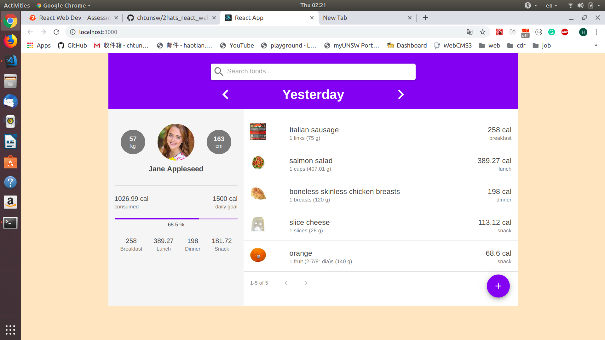
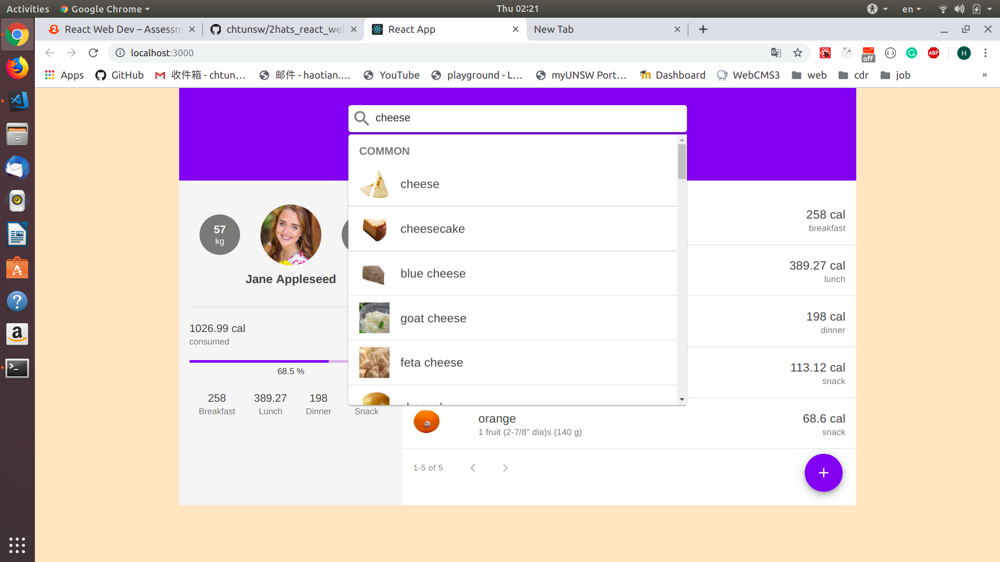
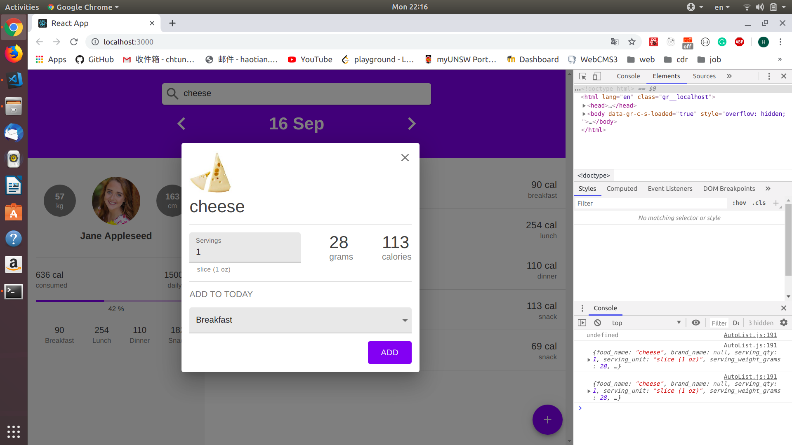
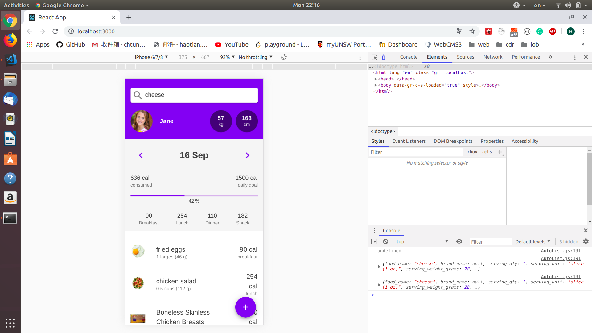
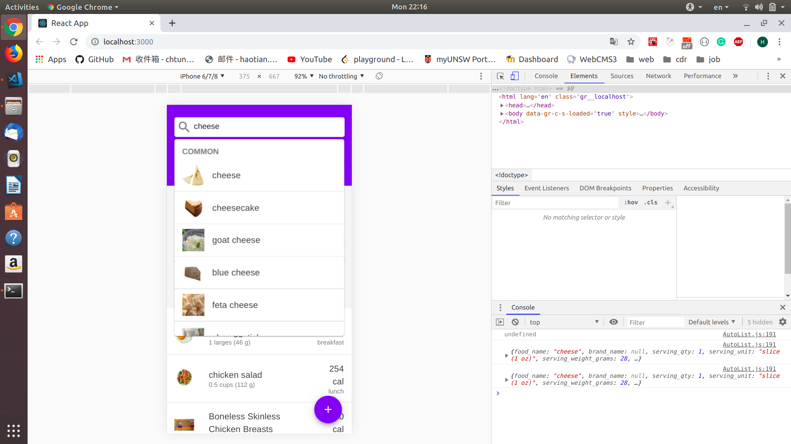
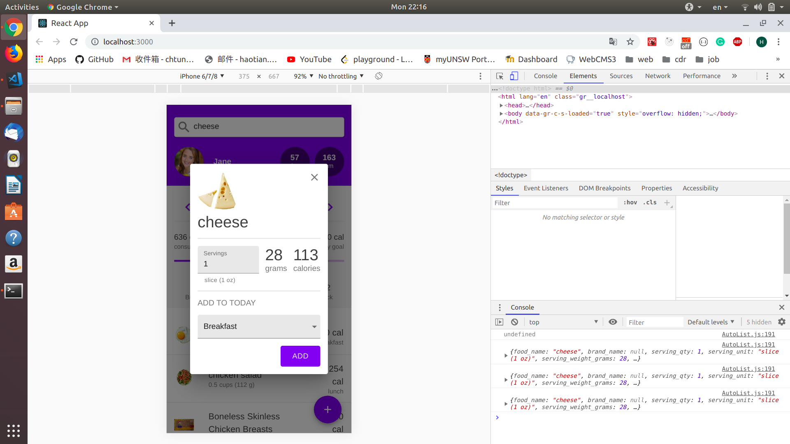

# Nutritionix Diet App

## Introduction

Sigle page app made up with 5 components: Header, AutoList, UserPanel, DietTable, AddButton.  
Commonly used states, including dateIndex and dietList, are created and maintained in redux store.

## How to start

npm install  
npm start

## Screen shots

  
  

